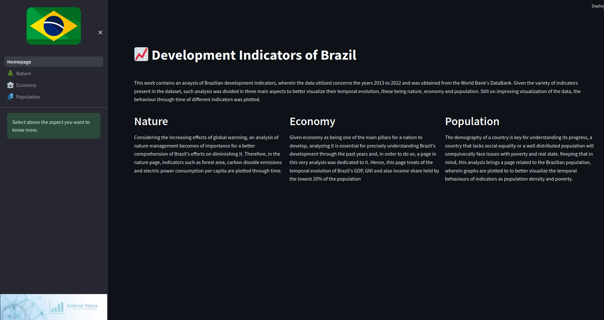

# Analysis of Brazil's Development Indicators

The present study has been conducted to understand the temporal evolution of Brazil's development indicators during the last decade, in this work the author has wrangled a dataset from The World Bank's DataBank and also developed a dashboard for better visualization of the results found.

The database utilized in this work was downloaded from:     
https://databank.worldbank.org/reports.aspx?source=2&country=BRA.

---

This is a work in progress and, as such, it is being periodically improved.
